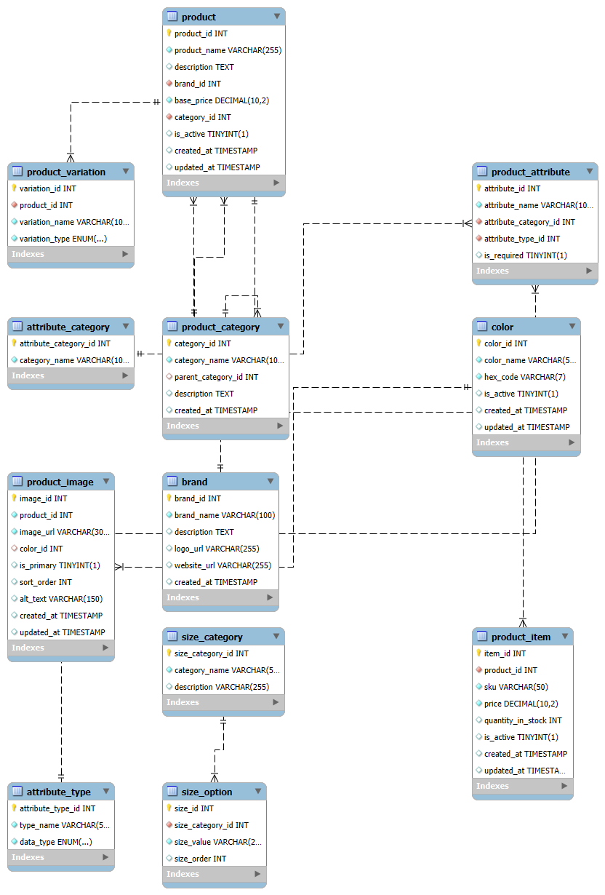

# ERD DIAGRAM FOR THE E-COMMERCE DBMS

# eCommerce Product Schema

This SQL schema represents a robust and scalable backend structure for managing a product catalog in an eCommerce system. It supports multiple features such as product hierarchies, color and size variations, branding, custom attributes, and images.

## TABLE OVERVIEW

| Table Name          | Description |
|---------------------|-------------|
| **`product`**           | Stores general product information, such as name, base price, and links to brand and category. Each product represents a conceptual item, like "Nike Air Max 90". |
| **`product_item`**      | Represents individual purchasable SKUs (e.g., "Nike Air Max 90 - Size 10, Red"). Each SKU has its own stock level and price. |
| **`product_image`**     | Contains URLs of product images. Can be color-specific and supports sorting, alt text, and marking primary images. |
| **`color`**             | Defines available colors with names and HEX codes. Used in images, variations, and filtering. |
| **`product_category`**  | Hierarchical system for organizing products (e.g., Electronics → Phones → Smartphones). Supports parent-child relationships. |
| **`brand`**             | Holds reusable brand data including name, logo, and website. Used to tag and filter products by manufacturer or label. |
| **`product_variation`** | Defines types of variations a product can have (e.g., "Color", "Size"). Each product can have multiple variations. |
| **`size_category`**     | Used to categorize different sizing systems like shoes, clothing, or electronics (e.g., "Men's Shoes", "TV Screen Sizes"). |
| **`size_option`**       | Specific sizes (e.g., "S", "M", "L", "42") within a size category. These can be used in dropdowns or filters. |
| **`product_attribute`** | Allows adding custom, structured specifications to products (e.g., "Processor", "Fabric", "Weight"). |
| **`attribute_category`**| Groups product attributes logically for UI sections (e.g., "Technical Specs", "Dimensions"). |
| **`attribute_type`**    | Defines the data type (text, number, boolean, date) of each attribute for validation and input control. |

## Constraints and Best Practices

- **Uniqueness**:
  - Unique constraints on SKU, color name, hex codes, and image URLs.
- **Referential Integrity**:
  - Cascading and nullifying behavior for foreign keys ensures clean deletion.
- **Scalability**:
  - Modular design allows easy additions (e.g., more variation types, new attributes).

  
## ✅ Use Cases

- Multi-variant product listings (e.g., sizes and colors).
- Admin panel for product management.
- Inventory and image management.
- Product filtering and attribute-based search.